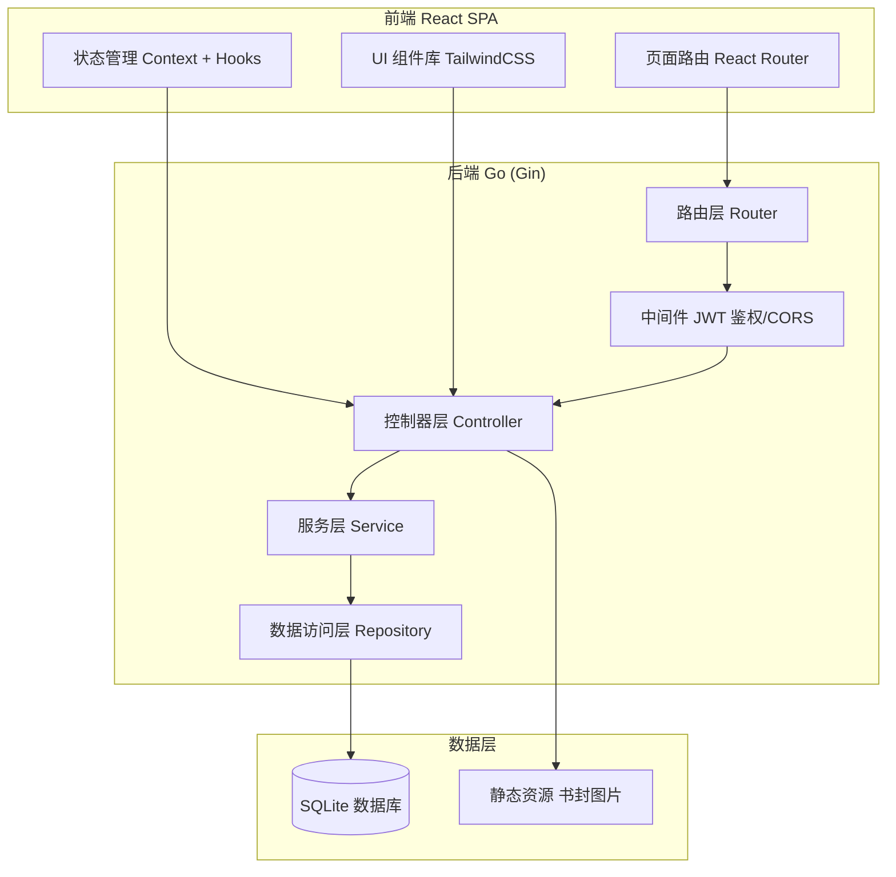
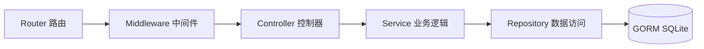
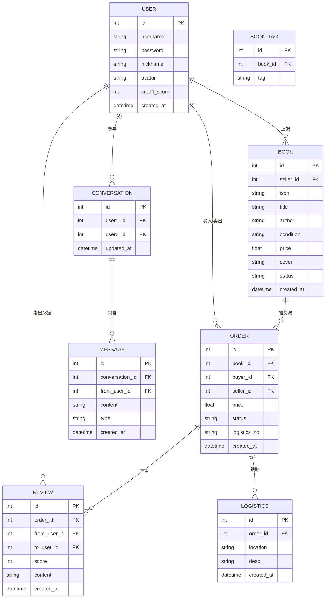

# 技术架构文档 - 校园二手书交易平台「书窝」

## 1. 架构设计

前后端分离架构：React 单页应用通过 RESTful API 调用 Go 后端，后端连接 SQLite 数据库。前端负责界面渲染与交互，后端负责业务逻辑与数据持久化。



## 2. 技术说明

- **前端**：React@18 + tailwindcss@3 + vite + react-router-dom@6
- **初始化工具**：vite-init
- **后端**：Go 1.21 + Gin@1.9 + GORM（SQLite 驱动）
- **数据库**：SQLite（轻量、零配置，适合校园项目，无需额外服务）
- **鉴权**：JWT（HS256）
- **图片上传**：后端本地静态目录 `uploads/`

## 3. 路由定义

| 路由 | 用途 |
|------|------|
| `/` | 首页：书签分类标签 + 书籍瀑布流 |
| `/sell` | 上架页：扫码录入 + 书籍信息表单 |
| `/book/:id` | 书籍详情页 |
| `/orders` | 订单页：状态时间轴 + 物流跟踪 |
| `/messages` | 消息页：会话列表 + 聊天窗口 |
| `/profile` | 个人中心：数据概览 + 在售/成交/评价 |

## 4. API 定义

### 4.1 认证模块

```typescript
// POST /api/auth/register
interface RegisterReq { username: string; password: string; nickname: string; }
interface RegisterRes { token: string; user: User; }

// POST /api/auth/login
interface LoginReq { username: string; password: string; }
interface LoginRes { token: string; user: User; }

// GET /api/auth/me
interface User {
  id: number; username: string; nickname: string; avatar: string;
  creditScore: number; createdAt: string;
}
```

### 4.2 书籍模块

```typescript
// GET /api/books?tag=&keyword=&page=
interface BookListRes { list: Book[]; total: number; }

// GET /api/books/:id
interface BookDetailRes extends Book { seller: User; }

// POST /api/books  (需鉴权)
interface CreateBookReq {
  isbn: string; title: string; author: string;
  condition: 'new' | 'nine' | 'eight'; price: number;
  tags: string[]; cover: string; description: string;
}

// POST /api/books/scan  扫码查书
interface ScanReq { isbn: string; }
interface ScanRes { title: string; author: string; cover: string; }

// GET /api/tags  分类标签
interface TagsRes { tags: string[]; }

interface Book {
  id: number; title: string; author: string; isbn: string;
  condition: string; price: number; tags: string[];
  cover: string; status: 'selling' | 'sold';
  sellerId: number; sellerName: string; createdAt: string;
}
```

### 4.3 订单模块

```typescript
// POST /api/orders  下单
interface CreateOrderReq { bookId: number; }
interface CreateOrderRes { order: Order; }

// GET /api/orders  我的订单
interface OrderListRes { orders: Order[]; }

// GET /api/orders/:id  订单详情(含物流)
interface OrderDetailRes extends Order { logistics: LogisticsItem[]; }

// PUT /api/orders/:id/ship  卖家发货
interface ShipReq { logisticsNo: string; }

// PUT /api/orders/:id/confirm  买家确认收货

interface Order {
  id: number; bookId: number; bookTitle: string; bookCover: string;
  buyerId: number; sellerId: number; price: number;
  status: 'pending' | 'shipped' | 'received' | 'done';
  logisticsNo: string; createdAt: string;
}
interface LogisticsItem { time: string; location: string; desc: string; }
```

### 4.4 消息模块

```typescript
// GET /api/messages/conversations  会话列表
interface ConversationListRes { conversations: Conversation[]; }

// GET /api/messages/:conversationId  消息记录
interface MessageListRes { messages: Message[]; }

// POST /api/messages  发送消息
interface SendMessageReq { conversationId: number; content: string; type: 'text' | 'offer'; offerPrice?: number; }

// POST /api/messages/conversation  创建/获取会话
interface CreateConvReq { toUserId: number; bookId?: number; }

interface Conversation { id: number; peerUser: User; lastMessage: string; unread: number; updatedAt: string; }
interface Message { id: number; conversationId: number; fromUserId: number; content: string; type: string; createdAt: string; }
```

### 4.5 评价模块

```typescript
// POST /api/reviews  提交评价
interface CreateReviewReq { orderId: number; score: number; content: string; }

// GET /api/reviews?userId=
interface ReviewListRes { reviews: Review[]; }

interface Review { id: number; orderId: number; fromUser: User; toUserId: number; score: number; content: string; createdAt: string; }
```

### 4.6 个人中心

```typescript
// GET /api/profile/books  我的在售
// GET /api/profile/orders?type=buy|sell  成交记录
// GET /api/profile/reviews  我的评价
// PUT /api/books/:id  编辑书籍
// DELETE /api/books/:id  下架书籍
```

## 5. 服务端架构图



## 6. 数据模型

### 6.1 数据模型定义



### 6.2 数据定义语言 (DDL)

```sql
CREATE TABLE users (
    id INTEGER PRIMARY KEY AUTOINCREMENT,
    username TEXT UNIQUE NOT NULL,
    password TEXT NOT NULL,
    nickname TEXT NOT NULL,
    avatar TEXT DEFAULT '',
    credit_score INTEGER DEFAULT 100,
    created_at DATETIME DEFAULT CURRENT_TIMESTAMP
);

CREATE TABLE books (
    id INTEGER PRIMARY KEY AUTOINCREMENT,
    seller_id INTEGER NOT NULL,
    isbn TEXT,
    title TEXT NOT NULL,
    author TEXT,
    condition TEXT NOT NULL,
    price REAL NOT NULL,
    cover TEXT,
    description TEXT,
    status TEXT DEFAULT 'selling',
    created_at DATETIME DEFAULT CURRENT_TIMESTAMP,
    FOREIGN KEY (seller_id) REFERENCES users(id)
);

CREATE TABLE book_tags (
    id INTEGER PRIMARY KEY AUTOINCREMENT,
    book_id INTEGER NOT NULL,
    tag TEXT NOT NULL,
    FOREIGN KEY (book_id) REFERENCES books(id)
);

CREATE TABLE orders (
    id INTEGER PRIMARY KEY AUTOINCREMENT,
    book_id INTEGER NOT NULL,
    buyer_id INTEGER NOT NULL,
    seller_id INTEGER NOT NULL,
    price REAL NOT NULL,
    status TEXT DEFAULT 'pending',
    logistics_no TEXT,
    created_at DATETIME DEFAULT CURRENT_TIMESTAMP,
    FOREIGN KEY (book_id) REFERENCES books(id),
    FOREIGN KEY (buyer_id) REFERENCES users(id),
    FOREIGN KEY (seller_id) REFERENCES users(id)
);

CREATE TABLE conversations (
    id INTEGER PRIMARY KEY AUTOINCREMENT,
    user1_id INTEGER NOT NULL,
    user2_id INTEGER NOT NULL,
    updated_at DATETIME DEFAULT CURRENT_TIMESTAMP,
    FOREIGN KEY (user1_id) REFERENCES users(id),
    FOREIGN KEY (user2_id) REFERENCES users(id)
);

CREATE TABLE messages (
    id INTEGER PRIMARY KEY AUTOINCREMENT,
    conversation_id INTEGER NOT NULL,
    from_user_id INTEGER NOT NULL,
    content TEXT NOT NULL,
    type TEXT DEFAULT 'text',
    created_at DATETIME DEFAULT CURRENT_TIMESTAMP,
    FOREIGN KEY (conversation_id) REFERENCES conversations(id),
    FOREIGN KEY (from_user_id) REFERENCES users(id)
);

CREATE TABLE reviews (
    id INTEGER PRIMARY KEY AUTOINCREMENT,
    order_id INTEGER NOT NULL,
    from_user_id INTEGER NOT NULL,
    to_user_id INTEGER NOT NULL,
    score INTEGER NOT NULL,
    content TEXT,
    created_at DATETIME DEFAULT CURRENT_TIMESTAMP,
    FOREIGN KEY (order_id) REFERENCES orders(id),
    FOREIGN KEY (from_user_id) REFERENCES users(id),
    FOREIGN KEY (to_user_id) REFERENCES users(id)
);

CREATE TABLE logistics (
    id INTEGER PRIMARY KEY AUTOINCREMENT,
    order_id INTEGER NOT NULL,
    location TEXT,
    desc TEXT,
    created_at DATETIME DEFAULT CURRENT_TIMESTAMP,
    FOREIGN KEY (order_id) REFERENCES orders(id)
);

CREATE INDEX idx_books_status ON books(status);
CREATE INDEX idx_books_tags ON book_tags(tag);
CREATE INDEX idx_orders_buyer ON orders(buyer_id);
CREATE INDEX idx_orders_seller ON orders(seller_id);
CREATE INDEX idx_messages_conv ON messages(conversation_id);
```
